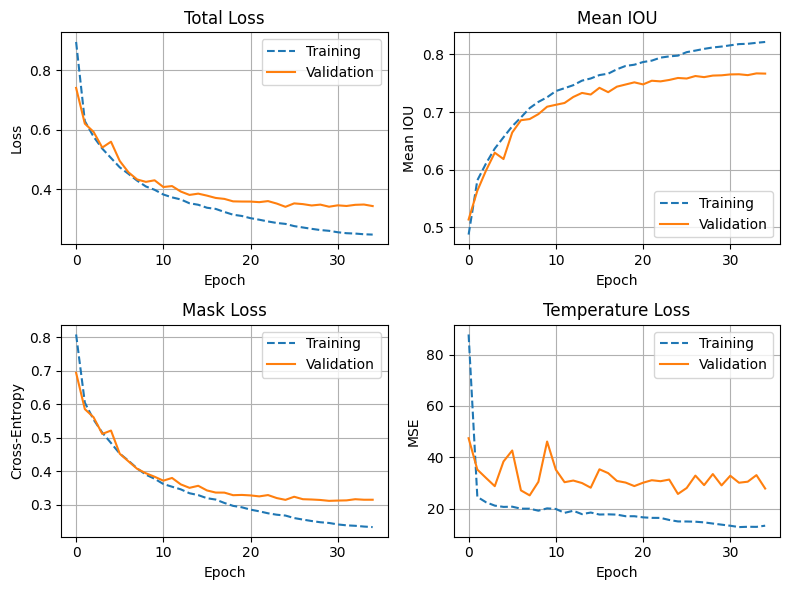
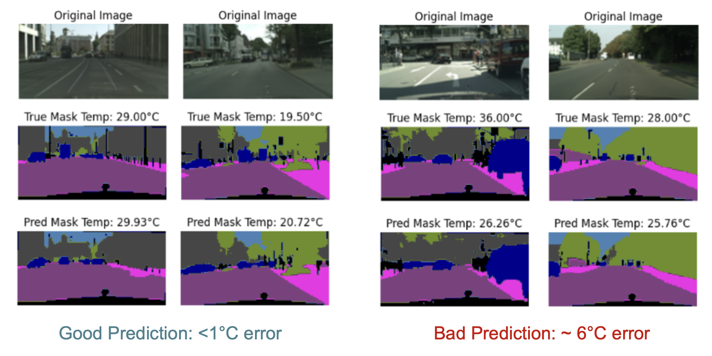

# VisTemp - Developing Visual Temperature Prediction from Semantic Segmentation of Street view Imagery

We developed a CNN model that transforms street view images into air temperature estimations by the means of scene semantic segmentation. 

The model combines both segmentation and temperature prediction, and was trained CityScape Dataset

Our result shows a mean IoU well above 0.7 and RMSE of 5.6 Celsius.

